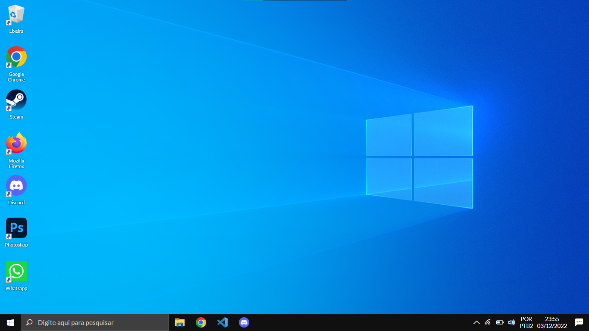

# Windows 10 Desktop Clone

---

This project recreates the Microsoft Windows 10 desktop for front-end skills training.

> ⚠️ This project was developed and will only work in 1366 x 768 resolution

 

## Credits

**Author**: Alberto Frigatto

**Email**: albertofrigatto.comercial@gmail.com

**Linkedin**: [Click Here](https://www.linkedin.com/in/alberto-frigatto-a72022251)
 

## Start

To start the project just click on `index.html`.
 

## package dependencies

- jQuery v3.6.5
- Bootstrap Icons